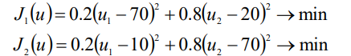
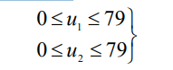
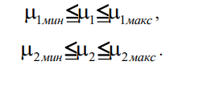
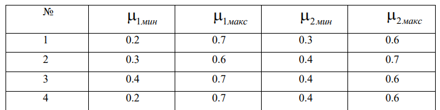

# Курс: Формализованные модели и методы решения аналитических задач

# Задание 2

Дана многокритериальная аналитическая задача:

Множество допустимых решений D задано в виде:

1. Сгенерировать на множестве D 100 равномерно распределенных точек.
2. Построить множество Парето-оптимальных решений.
3. Применить алгоритм исключения заведомо не эффективных решений.
4. На множестве Парето выделить множество Ω-оптимальных решений.
5. Полиэдральный конус доминирования Ω  соответствует интервалам  неопределенности весовых коэффициентов:

