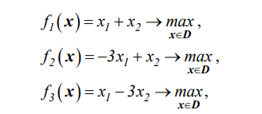
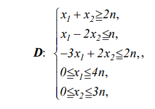
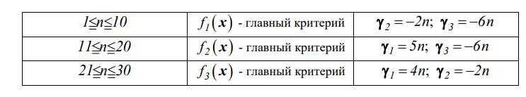

# Курс: Формализованные модели и методы решения аналитических задач

# Задание 3

Дана многокритериальная аналитическая задача.
Критерии:

Ограничения:

где
n – номер варианта задания

Решить поставленную задачу методом пороговой оптимизации, используя условия, заданные в таблице.

