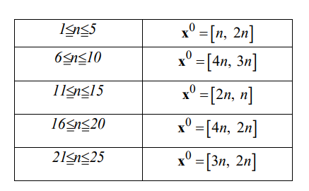

# Курс: Формализованные модели и методы решения аналитических задач

# Задание 4

Дана многокритериальная аналитическая задача.

Ограничения:

где n – номер варианта задания

Решить задачу методом «идеальной точки. Использовать алгоритм
Франка-Вульфа.
Начальные условия заданы в таблице.

