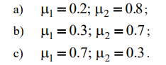

# Курс: Формализованные модели и методы решения аналитических задач

# Задание 6

Требуется определить оптимальный по Парето проект , используя
следующие методы.
1. Метод обобщенной функции. В качестве обобщенной функции использовать
линейую свертку. Решить задачу для вариантов:

2. Метод обобщенной функции. В качестве обобщенной функции использовать функцию Гермейера.
3. Метод главного критерия (пороговой оптимизации). Решить задачу для вариантов

4. Метод «идеальной точки».

