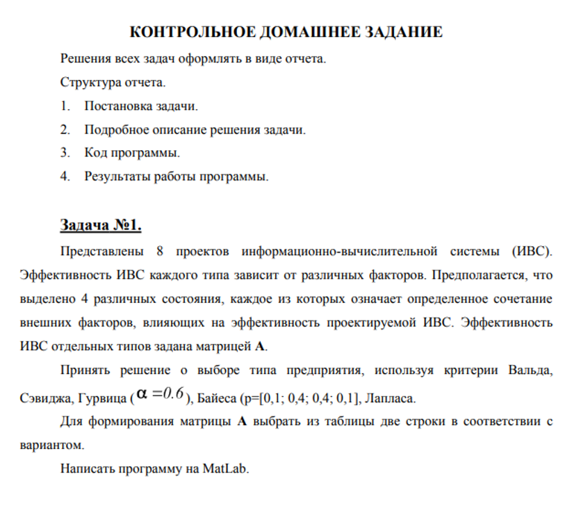

# Курс: Формализованные модели и методы решения аналитических задач

# Семестр 2 Задание 1

Принять решение о выборе типа предприятия, используя критерий Вальда, Сэвиджа, Гурвица, Байеса, Лапласа.

