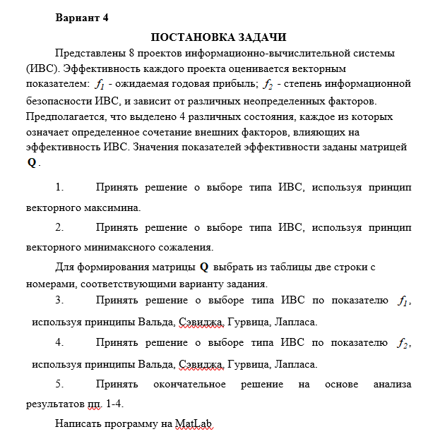

# Курс: Формализованные модели и методы решения аналитических задач

# Семестр 2 Задание 2

1.	Принять решение о выборе типа ИВС, используя принцип векторного максимина. 
2.	Принять решение о выборе типа ИВС, используя принцип векторного минимаксного сожаления. 
Для формирования матрицы   выбрать из таблицы две строки с номерами, соответствующими варианту задания.
3.	Принять решение о выборе типа ИВС по показателю  , используя принципы Вальда, Сэвиджа, Гурвица, Лапласа.
4.	Принять решение о выборе типа ИВС по показателю  , используя принципы Вальда, Сэвиджа, Гурвица, Лапласа.
5.	Принять окончательное решение на основе анализа результатов пп. 1-4.

