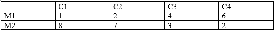

# Курс: Формализованные модели и методы решения аналитических задач

# Семестр 2 Задание 3

Фирма планирует выпуск новой модели изделия.
Спрос на модель не может быть точно определен. Однако можно предположить, что он характеризуется 4-мя возможными состояниями:

С1 – низкий;

С2 – средний;

С3 – высокий;

С4 - очень высокий.

С учетом этих состояний анализируются 2 возможные модификации данной модели: М1 и М2. Каждая из модификаций обеспечивает в конечном итоге различную прибыль.

