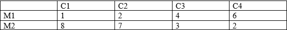

# Курс: Формализованные модели и методы решения аналитических задач

# Семестр 2 Задание 5

Фирма планирует выпуск новой модели изделия.
Спрос на модель не может быть точно определен. Однако можно предположить, что он характеризуется 4-мя возможными состояниями:

С1 – низкий;

С2 – средний;

С3 – высокий;

С4 - очень высокий.

С учетом этих состояний анализируются 2 возможные модификации данной модели: М1 и М2. Каждая из модификаций обеспечивает в конечном итоге различную прибыль.

Требуется определить объемы выпуска модификаций М1 и М2 (в %), обеспечивающие среднюю величину прибыли при любом состоянии спроса.

Формализовать исходную задачу в виде матричной игры.

Решить задачу, итерационным методом Брауна. Расписать первые 10 итераций в виде таблицы. Сравнить результат.

Сущность: организуется виртуальный процесс обучения игроков в многократно повторяющейся игре.
