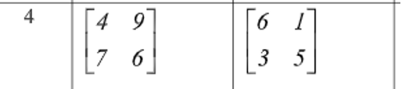

# Курс: Формализованные модели и методы решения аналитических задач

# Семестр 3 Задание 1

Дана бескоалиционная биматричная игра
1.	Найти равновесное по Нэшу решение графо-аналитическим методом.
2.	Построить множество Парето-оптимальных решений.
3.	Построить гарантированные решения игроков 1 и 2.
4.	Провести сравнительный анализ полученных решений.
5.	Построить имитационную модель для проверки свойств равновесия по Нэшу.
6.	Разработать ПО алгоритмов решения вышеперечисленных задач.

