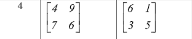

# Курс: Формализованные модели и методы решения аналитических задач

# Семестр 3 Задание 2

Дана бескоалиционная биматричная игра Дана кооперативная биматричная игра. Найти решение игры с помощью арбитражной схемы Нэша.

