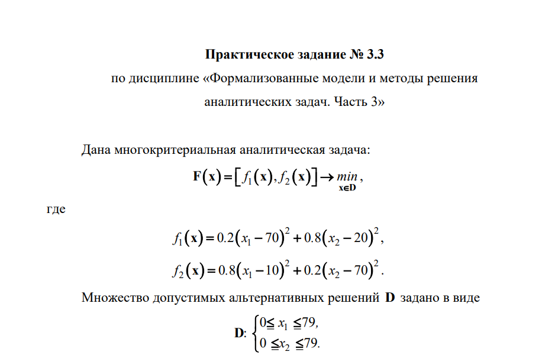

# Курс: Формализованные модели и методы решения аналитических задач

# Семестр 3 Задание 3

Дана бескоалиционная биматричная игра Дана кооперативная биматричная игра. Найти решение игры с помощью арбитражной схемы Нэша.

Разработать генетический алгоритм построения множества паретооптимальных решений поставленной задачи.
Требования к генетическому алгоритму.
1. При кодировании хромосом использовать бинарный код Грея.
2. Оператор селекции построить на основе турнирной схемы.
3. Использовать 3х-точечный оператор кроссовера: 

точка 1 – в
пределах компоненты
1
x
; 

точка 2 – фиксирована, разделяет компоненты
1
x
и
2
x
;

точка 3 – в пределах компоненты
2
x .
4. После каждой итерации элитные точки записывать в отдельный
массив элитных точек.
5. После выполнения всех итераций ГА выполнить сортировку
множества элитных точек по значению функции приспособленности.
Разработать ПО на языке Python

